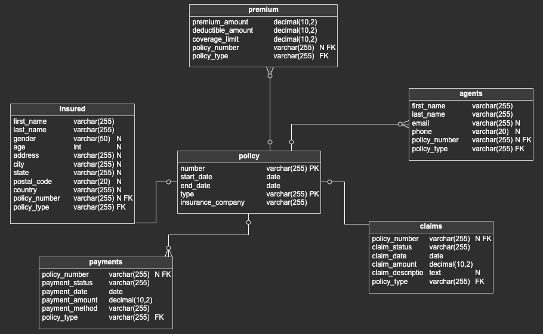

# Reto Monokera
Esta guía proporciona instrucciones detalladas para configurar y ejecutar la solución al reto compartido.

## Configuración de Airflow

### Instalación de Airflow:
Se inicia instalando Airflow mediante Docker Compose siguiendo las instrucciones en la [documentación oficial de Airflow](https://airflow.apache.org/docs/apache-airflow/stable/howto/docker-compose/index.html).

### Ajustes en Docker Compose:
Antes de lanzar Airflow, se recomiendan los siguientes ajustes en el archivo `docker-compose.yaml`:

- **Montajes de Volumen:**
  Es crucial incluir `/var/run/docker.sock` para permitir la interacción de Airflow con el daemon de Docker. Se añade la siguiente línea en la sección de `volumes`:
  ```bash
  - /var/run/docker.sock:/var/run/docker.sock
  ```
- **Requisitos Adicionales:**
Para integrar el proveedor de Docker en Airflow, se modifica la variable `_PIP_ADDITIONAL_REQUIREMENTS` a:
```bash
_PIP_ADDITIONAL_REQUIREMENTS: ${_PIP_ADDITIONAL_REQUIREMENTS:-apache-airflow-providers-docker>=2.0.0}
```
- **Permisos de Docker Socket:**
Se otorgan los permisos necesarios ejecutando:

```bash
sudo chmod 777 /var/run/docker.sock
```
- **Cargar Ejemplos (Opcional):**
Para evitar cargar ejemplos de Airflow, se configura a:

```bash
AIRFLOW__CORE__LOAD_EXAMPLES: 'false'
```

### Configuración del Repositorio de Datos
Se ha seleccionado PostgreSQL como solución de almacenamiento, utilizando una instancia en la nube a través de ElephantSQL.

- **Cadena de Conexión:**
En la interfaz web de Airflow, se crea una variable de entorno (Admin > Variables) con la clave `db_params` y el valor JSON correspondiente, ajustando los parámetros a su configuración:

```json
{
    "DB_USER": "******",
    "DB_PASSWORD": "******",
    "DB_HOST": "******",
    "DB_NAME": "******"
}
```
- **Modelo Relacional**
Para una vista detallada del modelo relacional y el DDL SQL correspondiente, se consulta el archivo `/src/scripts/postgres/ddl.sql`` en el repositorio.



### Ejecución
Se siguen los siguientes pasos para ejecutar el flujo de trabajo:

- **1. Clonar el Repositorio:**
  ```bash
  git clone https://github.com/byroncz/monokera.git
  ```
- **2. Construir el Entorno de Procesamiento:**
Desde el directorio raíz del repositorio, se ejecuta:
```bash
docker build -t processor:latest -f ./img/Dockerfile.processor .
```
Este comando construye la imagen Docker que se utilizará para procesar los datos.

- **3. Lanzar el DAG:**
* Se copia el DAG `/dag/monokera.py al directorio de DAGs en la instalación de Airflow.
* Se accede al servidor web de Airflow, se inicia sesión y se activa la ejecución del DAG monokera.